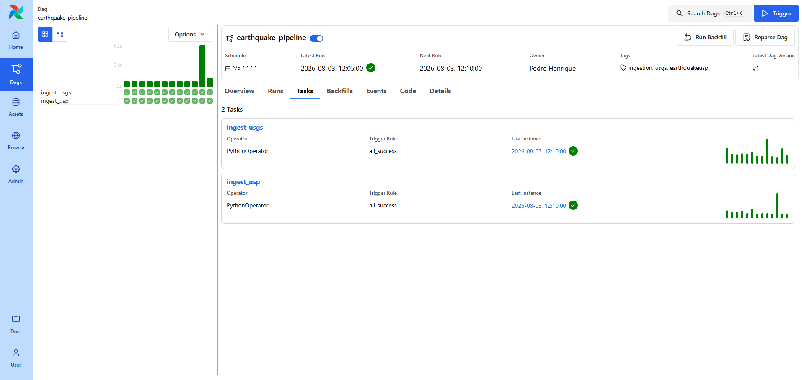
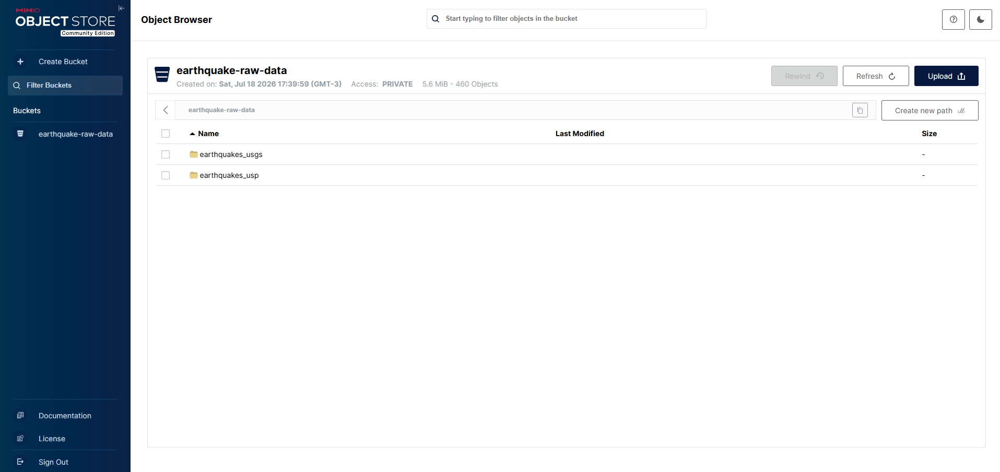

## The starting point

A recent sequence of earthquakes in Venezuela raised a simple question: is it possible to track this in real time, without waiting for delayed news coverage?

That question became the starting point for building a complete data engineering pipeline from scratch. The goal wasn't just a nice dashboard at the end, but going through every real stage of a data engineering project: multi-source ingestion, automated orchestration, organized storage, tested transformations, and finally, visualization.


## Architecture

The pipeline follows a medallion architecture, split into three layers: bronze (raw data), silver (cleaned and standardized data), and gold (aggregated metrics, ready for consumption).

```
USGS API ──┐
            ├──► Airflow ──► MinIO (raw, partitioned) ──► dbt / DuckDB ──► Power BI
USP/IAG ───┘                                             (bronze → silver → gold)
```

- **Ingestion:** two independent Python clients, one for each data source
- **Orchestration:** Apache Airflow 3, with two parallel tasks, refreshing every 5 minutes
- **Storage:** MinIO (S3-compatible), in Parquet format, partitioned by source and date
- **Transformation:** dbt + DuckDB, with 10 automated data quality tests and auto-generated documentation
- **Visualization:** Power BI Desktop, connected directly to DuckDB


## Two independent data sources

One of the core parts of this project was combining two very different seismic data sources:

- **USGS Earthquake API**, from the US Geological Survey, with global coverage and near-instant updates
- **USP/IAG FDSN Web Services**, Brazil's seismographic network, which captures regional events that the American system often doesn't detect

Using two sources gave the pipeline broader coverage, but it also created the project's biggest technical challenge.

## The real challenge: unifying different sources

Connecting the APIs wasn't the hard part. The real challenge was unifying two sources that describe the same earthquake in completely different ways: different location formats, different date formats, and the possibility of the same event appearing twice across both sources.

This was solved at the silver layer, using `ROW_NUMBER()` for deduplication and automated quality tests to ensure data consistency on every pipeline run.



## Organized storage

Raw data is stored in MinIO, partitioned by source and date (`year=/month=/day=`), which makes both auditing and selective reprocessing easier, without needing to re-read the entire history on every run.



## A deliberate decision: paid cloud, last

The original plan included BigQuery, Cloud Storage, and Looker Studio. Midway through, I decided to reverse the order: validate the entire architecture locally, with MinIO and DuckDB, before committing to any paid cloud infrastructure.

This wasn't a limitation, it was a strategic choice. Proving that a solution works end-to-end before spending money is common practice among data teams, and the migration path to GCP is already documented in the project's README as a next step.

## Known limitations

The country field is extracted from text, based on each event's location string, rather than through reverse geocoding of coordinates. This works well for most cases, but is imprecise for offshore events and for some USP records that only come in a "City/State" format, without a country suffix. This limitation is documented in the README as a possible next improvement.

## The result

The project is publicly available on GitHub, with a complete README covering the goal, architecture, reproducible setup instructions, project structure, known limitations, and next steps.

[View the full project on GitHub →](https://github.com/pedrohentec/earthquake-pipeline)