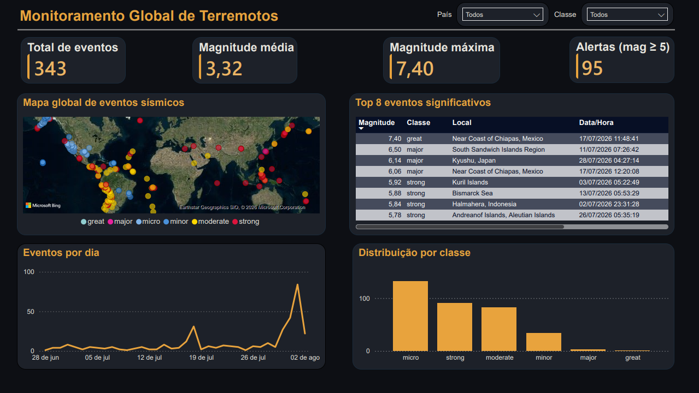

## O ponto de partida

Uma sequência de terremotos recentes na Venezuela me trouxe uma pergunta simples: dá para acompanhar isso em tempo real, sem depender de notícia atrasada?

A partir dessa pergunta, decidi construir um pipeline de dados completo, do zero, para responder isso na prática. O objetivo não era só ter um dashboard bonito no final, mas passar por todas as etapas reais de um projeto de engenharia de dados: ingestão de múltiplas fontes, orquestração automática, armazenamento organizado, transformação com testes de qualidade e, por fim, visualização.



## Arquitetura

O pipeline foi desenhado seguindo uma arquitetura medalhão, dividida em três camadas: bronze (dados brutos), silver (dados limpos e padronizados) e gold (métricas agregadas, prontas para consumo).

```
USGS API ──┐
            ├──► Airflow ──► MinIO (raw, particionado) ──► dbt / DuckDB ──► Power BI
USP/IAG ───┘                                              (bronze → silver → gold)
```

- **Ingestão:** dois clients Python independentes, um para cada fonte de dados
- **Orquestração:** Apache Airflow 3, com duas tasks rodando em paralelo, atualizando a cada 5 minutos
- **Armazenamento:** MinIO (compatível com S3), em formato Parquet, particionado por fonte e por data
- **Transformação:** dbt + DuckDB, com 10 testes automatizados de qualidade e documentação gerada automaticamente
- **Visualização:** Power BI Desktop, conectado diretamente ao DuckDB


## As duas fontes de dados

Um dos pontos centrais do projeto foi combinar duas fontes de dados sísmicos bem diferentes entre si:

- **USGS Earthquake API**, do serviço geológico americano, com cobertura global e atualização praticamente instantânea
- **USP/IAG FDSN Web Services**, da rede sismográfica brasileira, que capta eventos regionais no Brasil que o sistema americano muitas vezes não enxerga

Ter duas fontes trouxe cobertura mais completa, mas também trouxe o maior desafio técnico do projeto.

## O desafio real: unificar fontes diferentes

Conectar as APIs não foi a parte difícil. O verdadeiro desafio foi unificar duas fontes que descrevem o mesmo terremoto de formas completamente diferentes: formatos de local distintos, formatos de data distintos, e a possibilidade de o mesmo evento aparecer duplicado nas duas fontes.

Esse problema foi resolvido na camada silver, com deduplicação usando `ROW_NUMBER()` e testes de qualidade automatizados garantindo que a consistência dos dados se mantivesse a cada nova execução do pipeline.


## Armazenamento organizado

Os dados brutos são armazenados no MinIO, particionados por fonte e por data (`year=/month=/day=`), o que facilita tanto a auditoria quanto o reprocessamento seletivo, sem precisar reler todo o histórico a cada execução.


## Uma decisão consciente: nuvem paga por último

O plano inicial incluía BigQuery, Cloud Storage e Looker Studio. No meio do caminho, decidi inverter a ordem: validar a arquitetura inteira localmente, com MinIO e DuckDB, antes de comprometer qualquer estrutura paga na nuvem.

Essa não foi uma limitação, foi uma escolha estratégica. Provar que a solução funciona de ponta a ponta antes de gastar dinheiro é uma prática comum em times de dados, e o caminho de migração para GCP já está documentado no README do projeto como próximo passo.

## Limitações conhecidas

O campo de país é extraído por texto, a partir do campo de localização de cada evento, e não por geocodificação reversa de coordenadas. Isso funciona bem para a maioria dos casos, mas é impreciso em eventos no alto-mar e em alguns registros da USP que aparecem apenas no formato "Cidade/UF", sem o sufixo do país. Essa limitação está documentada no README como uma possível próxima etapa de melhoria.

## O resultado

O projeto está disponível publicamente no GitHub, com um README completo em inglês, cobrindo objetivo, arquitetura, instruções de reprodução, estrutura do projeto, limitações conhecidas e próximos passos.

[Ver o código completo no GitHub →](https://github.com/pedrohentec/earthquake-pipeline)